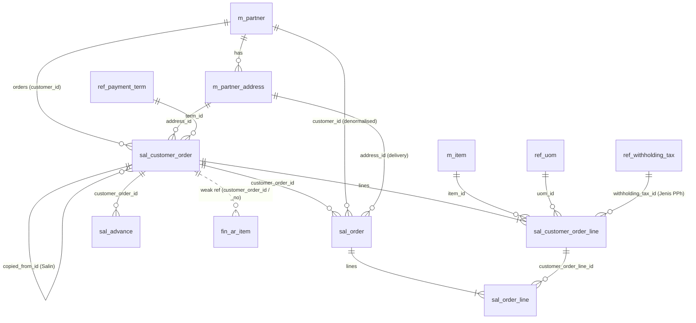
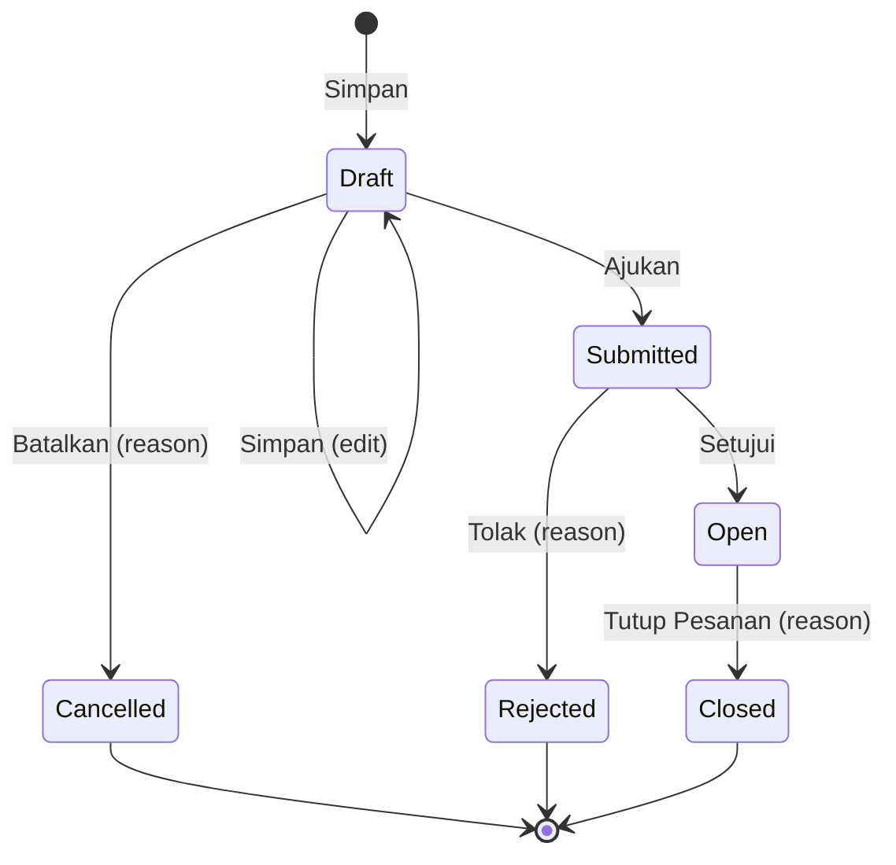
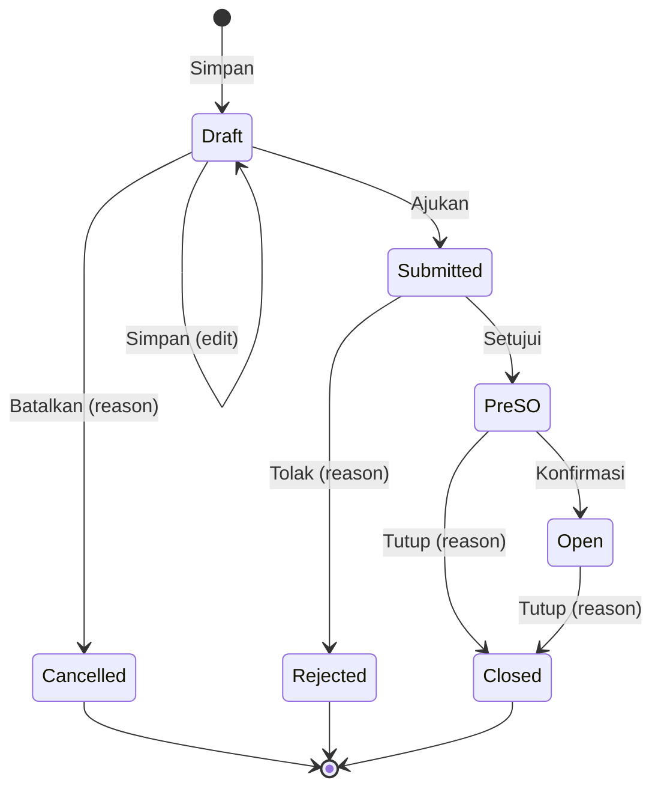
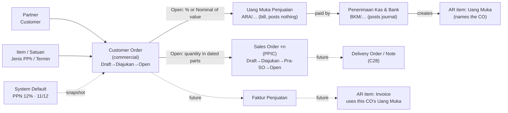

# Customer Order & Sales Order — Logic and Flow

> A developer briefing on the two order documents of the sales module: what
> each one is, how they are stored, how they move through their lifecycle,
> how their figures are computed and rounded, and how they connect to each
> other and to the documents downstream.
>
> **Written:** 02/10/2026, against the schema as of migration
> `20260929233202_retire_currency_and_pph22_defaults` plus the Sales Order
> (P79). **Authority:** `Claude-ERP.md` (decisions P49–P82) and
> `tax_concept.md`. Where this file and those disagree, they win.
> Decision numbers (Pxx, Cxx) refer to `Claude-ERP.md` §12 / §18.

---

## Contents

1. [The two documents at a glance](#1-the-two-documents-at-a-glance)
2. [Data model](#2-data-model)
3. [Customer Order](#3-customer-order)
4. [Sales Order](#4-sales-order)
5. [How everything connects](#5-how-everything-connects)
6. [Tax arithmetic and rounding](#6-tax-arithmetic-and-rounding)
7. [Integrity: snapshots, locks and concurrency](#7-integrity-snapshots-locks-and-concurrency)
8. [Numbering, audit and permissions](#8-numbering-audit-and-permissions)
9. [Known gaps and what is not built yet](#9-known-gaps-and-what-is-not-built-yet)
10. [Glossary](#10-glossary)

---

## 1. The two documents at a glance

The split is **commercial vs. operational**. The Customer Order is the deal
with the customer; the Sales Order is a dated slice of that deal released to
production planning (PPIC).

| | **Customer Order (CO)** | **Sales Order (SO)** |
| --- | --- | --- |
| What it is | The commercial agreement: what the customer ordered, at what price, under which tax treatment | One dated part of a CO's quantity, released to PPIC |
| Example | 10.000 PCS of item A at Rp15.000, Kena PPN, PPh 22 | 2.000 PCS of item A, to ship 15/11/2026 (one of five such SOs) |
| Number | `CO/YYYY/MM/NNNN` | `SO/YYYY/MM/NNNN` |
| Tables | `sal_customer_order`, `sal_customer_order_line` | `sal_order`, `sal_order_line` |
| Carries | Customer, address, term, PO, price, discount, PPN, PPh, totals | Quantity, delivery date, delivery address — **no price, no tax** |
| Parent | — (starts from the customer) | Exactly one **Open** CO |
| Basis of | Every **financial** document: Uang Muka Penjualan (advance bill), later the Faktur Penjualan, AR items | **Operational** planning: material purchasing (Pra-SO), later production (Open) |
| Posts a journal? | Never | Never |
| Is an AR item? | No (AR items *name* it) | No |
| Lifecycle | Draft → Diajukan → Open → Ditutup | Draft → Diajukan → Pra-SO → Open → Ditutup |

Scope limits in force:

- **Barang only** (P49): CO lines offer items of type Barang marked *Dapat
  Dijual*. Jasa sales come later.
- **Rupiah only** (P13): no currency column on either document.
- **No credit control** (P50): no credit limit, no sales block.
- **Stock is ignored** (P5): no stock check, no warehouse on either order
  (P63); the warehouse is picked on the future delivery document.
- **No delivery documents yet** (C28): both orders close by hand.

---

## 2. Data model

### 2.1 Entity relationships



Solid lines are foreign keys (same module, or a reference into master data).
The dotted line is a **weak reference**: `fin_ar_item` lives in the AR book,
which is a different module, so it names the CO by id and number without a
foreign key (module contract, `Claude-ERP.md` §3.1).

### 2.2 Tables (DBML)

Columns as in `DBML/erp.dbml.md`; notes added here explain the logic. Common
columns `created_by`, `updated_by`, `created_at`, `updated_at` are omitted
below but present on every header table.

```dbml
Enum CustomerOrderStatus { Draft  Submitted  Open  Closed  Cancelled  Rejected }
Enum SalesOrderStatus    { Draft  Submitted  PreSO  Open  Closed  Cancelled  Rejected }
Enum PriceMode           { Exclude  Include }
Enum DiscountType        { Percent  Amount }

Table sal_customer_order {
  id                         int [pk, increment]
  order_no                   varchar [unique, note: 'CO/YYYY/MM/NNNN, series = month of order_date']
  order_date                 date
  status                     CustomerOrderStatus [default: 'Draft']
  customer_id                int [ref: > m_partner.id, note: 'must be a Customer, active, tax data complete, ≥1 address']
  address_id                 int [ref: > m_partner_address.id, note: 'one of the customer addresses, by id — never copied text (P53)']
  term_id                    int [ref: > ref_payment_term.id, note: 'defaults from customer.default_term_id']
  is_taxable                 boolean [default: true, note: 'Kena PPN — one decision for the whole order (P52)']
  price_mode                 PriceMode [note: 'asked only when is_taxable; stored Exclude otherwise (P63)']
  ppn_rate                   decimal(9,4) [null, note: 'SNAPSHOT of System Default, e.g. 12; null when not taxable']
  ppn_dpp_other_numerator    int [null, note: 'SNAPSHOT, e.g. 11']
  ppn_dpp_other_denominator  int [null, note: 'SNAPSHOT, e.g. 12']
  po_no                      varchar [null, note: 'customer PO number']
  po_date                    date [null, note: '≤ order_date']
  salesperson                varchar [null, note: 'free text']
  note                       varchar [null]
  gross_amount               decimal(18,2) [note: 'Σ line gross (DERIVED)']
  discount_amount            decimal(18,2) [note: 'Σ line discount (DERIVED)']
  dpp_amount                 decimal(18,2) [note: 'Σ line DPP (DERIVED)']
  dpp_other_amount           decimal(18,2) [note: 'Σ line DPP Nilai Lain (DERIVED)']
  ppn_amount                 decimal(18,2) [note: 'Σ line PPN (DERIVED)']
  total_amount               decimal(18,2) [note: 'dpp_amount + ppn_amount (DERIVED)']
  status_reason              varchar [null, note: 'why Cancelled / Rejected / Closed']
  copied_from_id             int [null, ref: > sal_customer_order.id, note: 'set by Salin']
}

Table sal_customer_order_line {
  id                  int [pk, increment]
  order_id            int [ref: > sal_customer_order.id]
  line_no             int [note: 'unique per order']
  item_id             int [ref: > m_item.id, note: 'Barang + can_sell + Active']
  uom_id              int [ref: > ref_uom.id, note: 'item base unit or one of its m_item_uom conversions']
  uom_factor          decimal(18,4) [note: 'SNAPSHOT of the conversion to the base unit (1 for base)']
  qty                 decimal(18,4) [note: '> 0, in uom_id']
  price               decimal(18,2) [note: 'per unit, in the order price_mode (incl. or excl. PPN)']
  discount_type       DiscountType [null, note: 'null = no discount']
  discount_value      decimal(18,4) [null, note: 'a percent (< 100) or a nominal amount']
  discount_amount     decimal(18,2) [note: 'DERIVED']
  amount              decimal(18,2) [note: 'qty × price − discount, whole rupiah (DERIVED)']
  dpp_amount          decimal(18,2) [note: 'DERIVED — tax base']
  dpp_other_amount    decimal(18,2) [note: 'DERIVED — DPP Nilai Lain']
  ppn_amount          decimal(18,2) [note: 'DERIVED']
  withholding_tax_id  int [null, ref: > ref_withholding_tax.id, note: 'Jenis PPh; null = Tanpa PPh']
  withholding_rate    decimal(9,4) [null, note: 'SNAPSHOT of the Jenis PPh rate']
  note                varchar [null]
  indexes { (order_id, line_no) [unique] }
}

Table sal_order {
  id                 int [pk, increment]
  order_no           varchar [unique, note: 'SO/YYYY/MM/NNNN']
  order_date         date [note: '≥ the CO order_date']
  delivery_date      date [note: 'Tanggal Kirim, ≥ order_date — what PPIC plans to']
  status             SalesOrderStatus [default: 'Draft']
  customer_order_id  int [ref: > sal_customer_order.id, note: 'chosen once, locked after first save']
  customer_id        int [ref: > m_partner.id, note: 'copied from the CO, for listing only']
  address_id         int [ref: > m_partner_address.id, note: 'any customer address; starts on the CO one']
  note               varchar [null]
  status_reason      varchar [null]
}

Table sal_order_line {
  id                      int [pk, increment]
  order_id                int [ref: > sal_order.id]
  line_no                 int
  customer_order_line_id  int [ref: > sal_customer_order_line.id, note: 'item and unit are READ from here, not stored']
  qty                     decimal(18,4) [note: '> 0, in the CO line unit, ≤ what is left on the CO line']
  note                    varchar [null]
  indexes {
    (order_id, line_no) [unique]
    (order_id, customer_order_line_id) [unique, note: 'a CO line appears once per SO']
  }
}
```

### 2.3 Masters and settings the orders read

| Source | Read for | Rule |
| --- | --- | --- |
| `m_partner` (category Customer) | CO customer | Active; Tipe WP, Jenis Identitas, NPWP/NIK and Nama Pajak filled; at least one address |
| `m_partner.default_term_id`, `default_price_mode` | Pre-fill a new CO | Only a default; the CO may change them (P51) |
| `m_partner.vat_collector` | PPN collected by the buyer (estimate only) | `Government` → the buyer keeps the PPN (see §6.7) |
| `m_partner_address` | CO address, SO delivery address | Must belong to the customer. An address a document uses cannot be removed from the Partner (P53) |
| `ref_payment_term` | CO term | Active |
| `m_item`, `m_item_uom` | CO line item and unit | Barang, Dapat Dijual, Active; unit = base unit (factor 1) or a listed conversion |
| `ref_withholding_tax` | CO line Jenis PPh | Active; its rate is snapshotted on the line |
| `sys_setting` `ppn_rate`, `ppn_dpp_other_numerator`, `ppn_dpp_other_denominator` | PPN computation | Seeded 12 / 11 / 12. A taxable CO is refused if any is missing |

### 2.4 Stored vs derived

- **Inputs** the user types: header choices, `qty`, `price`, `discount_type`,
  `discount_value`, `withholding_tax_id`, SO `qty`, dates.
- **Snapshots** copied at save so later master changes do not move a
  document: `ppn_rate`, the 11/12 factor, `uom_factor`, `withholding_rate`.
- **Derived** figures (`amount`, `discount_amount`, `dpp_*`, `ppn_*`,
  header totals) are computed by the one tax module (§6) and **stored**, so
  the document, its print and every downstream document read the same
  numbers without recomputing them.
- **Not stored anywhere:** how much of a CO line the SOs hold, and how much
  of a CO's value the advance bills have drawn. Both are **summed on read**
  from the child rows (§5.2, §5.3) — there is no counter column to drift.

---

## 3. Customer Order

### 3.1 Creating one

1. Pick the **Customer**. The form fills:
   - **Address** ← the customer's first address (any address may be chosen,
     whatever its Penagihan / Pengiriman flags).
   - **Termin** ← `default_term_id` if set.
   - **Mode Harga** ← `default_price_mode` if set.
2. Decide **Kena PPN** (Ya / Tidak). Only when *Ya* is **Include / Exclude
   PPN** asked; a non-taxable order is stored as `Exclude`.
3. Optional: PO number and date, salesperson, note.
4. Add **lines**: item, quantity + unit, unit price (in the chosen price
   mode), discount (% or Nominal; empty = none), Jenis PPh (empty = *Tanpa
   PPh*). The form offers each item once per order.
5. **Simpan** → a Draft with its number. Totals are computed and stored.

**Salin** (copy) starts a new Draft from any CO: same customer and lines,
dated today, without the customer's PO, with `copied_from_id` pointing back.
It is how a Rejected order is re-entered.

### 3.2 Validation (enforced on the server at every save, and again at Ajukan)

| Area | Rule |
| --- | --- |
| Dates | `order_date` required. `po_date` optional, not after `order_date` |
| Customer | Category Customer; Active; tax identity complete; has ≥ 1 address |
| Address | Belongs to that customer |
| Term | Exists and Active |
| Price mode | `Exclude` or `Include`; forced to `Exclude` when not taxable |
| Lines | At least one |
| Item | Exists; type Barang; Dapat Dijual; Active |
| Unit | The item's base unit (factor 1) or one of its conversions (factor stored) |
| Qty | > 0 |
| Price | > 0 |
| Discount | Not negative; a percent must be < 100; may not consume the line (amount must stay > 0) |
| Jenis PPh | If set: exists and Active; its rate is copied to the line |
| PPN settings | A taxable order needs all three settings, else it is refused by name |

On failure nothing is written; errors come back keyed to the field or line
(`lines.<i>.<field>`).

### 3.3 Lifecycle



| Step | From → To | Permission | What happens |
| --- | --- | --- | --- |
| Simpan | (new) / Draft → Draft | `CUSTOMER_ORDER_CREATE` / `_EDIT` | Full validation; lines replaced whole; totals and PPN snapshot recomputed with the settings in force **now** |
| Ajukan | Draft → Submitted (*Diajukan*) | `CUSTOMER_ORDER_SUBMIT` | Re-validates the stored order against today's masters (a customer, item or Jenis PPh deactivated since the save stops it). **Re-computes and freezes** totals, line DPP/PPN and the PPN snapshot with the settings in force at that moment. From here nothing on the order can be edited, and it is **not taken back** |
| Setujui | Submitted → Open | `CUSTOMER_ORDER_APPROVE` | Status only. The holder may approve their own order |
| Tolak | Submitted → Rejected (*Ditolak*) | `CUSTOMER_ORDER_APPROVE` | Reason required. Final; re-enter with Salin |
| Batalkan | Draft → Cancelled (*Dibatalkan*) | `CUSTOMER_ORDER_CANCEL` | Reason required. Final; the number stays as a trace |
| Tutup Pesanan | Open → Closed (*Ditutup*) | `CUSTOMER_ORDER_CLOSE` | Reason required. Allowed with quantity undelivered and with issued advance bills (they are untouched). **Refused while any SO from this CO is Draft, Diajukan, Pra-SO or Open.** Final |

The reason of any final step is stored in the single column `status_reason`.

### 3.4 What each status allows downstream

| CO status | Edit | New SO from it | New advance bill from it | Existing SOs / bills |
| --- | --- | --- | --- | --- |
| Draft | ✔ | ✘ | ✘ | — |
| Submitted | ✘ | ✘ | ✘ | — |
| **Open** | ✘ | ✔ | ✔ | continue normally |
| Closed | ✘ | ✘ | ✘ | stay as they are (no SO may be live, by the close guard) |
| Cancelled / Rejected | ✘ | ✘ | ✘ | — (never reached Open) |

---

## 4. Sales Order

### 4.1 Creating one

1. Pick an **Open Customer Order**. It is fixed from then on: to use another
   CO, make another SO. The customer is copied for listing.
2. **Delivery address** starts on the CO's address; any of the customer's
   addresses may be chosen.
3. Set **Tanggal SO** and **Tanggal Kirim**.
4. **Tambah Item** opens the CO's lines in a dialog showing, per line:
   *Qty CO*, *Sudah di-SO* (held by other SOs) and *Sisa*. A line with
   nothing left is shown but not pickable. *Terapkan* makes the ticked lines
   SO lines; a line already on the page keeps its quantity, an unticked one
   leaves (P81).
5. Type the **quantity** per line, in the CO line's unit (shown as
   `2.000 PCS`); the remaining ceiling shows as a hint. A blank quantity is
   refused on its row — every line was picked on purpose.
6. **Simpan** → Draft with its number.

The SO line stores only the CO line id and the quantity. Item, unit, price
and tax are **read through the CO line**; they are never copied.

### 4.2 Validation (server, at save and again at Ajukan)

| Area | Rule |
| --- | --- |
| Customer Order | Required; exists; status **Open**; its customer still Active |
| Tanggal SO | Required; not before the CO's `order_date` |
| Tanggal Kirim | Required; not before Tanggal SO |
| Address | Belongs to the CO's customer |
| Lines | At least one; each names a line **of this CO**; each CO line at most once per SO |
| Qty | > 0; at most 4 decimals; **≤ Sisa of the CO line** (§5.2) |
| CO change | On edit, `customer_order_id` cannot change |

### 4.3 Lifecycle



| Step | From → To | Permission | What happens |
| --- | --- | --- | --- |
| Simpan | (new) / Draft → Draft | `SALES_ORDER_CREATE` / `_EDIT` | Locks the CO row, validates, writes; lines replaced whole |
| Ajukan | Draft → Submitted | `SALES_ORDER_SUBMIT` | Locks the CO row and **re-checks** the stored SO: CO still Open, every quantity still within Sisa (another SO may have taken some since the Draft was saved). Then locked for editing |
| Setujui | Submitted → **Pra-SO** | `SALES_ORDER_APPROVE` | May be used to buy material, not to produce |
| Tolak | Submitted → Rejected | `SALES_ORDER_APPROVE` | Reason. Final. Quantity returns to the CO |
| Konfirmasi | Pra-SO → **Open** | `SALES_ORDER_CONFIRM` | May also be produced |
| Batalkan | Draft → Cancelled | `SALES_ORDER_CANCEL` | Reason. Final. Quantity returns to the CO |
| Tutup | Pra-SO / Open → Closed | `SALES_ORDER_CLOSE` | Reason. Final. **Quantity stays held** on the CO |

Purchasing and production do not exist yet, so Pra-SO and Open differ only in
name today. An approved SO is closed, never cancelled, because purchasing may
already lean on it.

### 4.4 Which statuses hold quantity, and which are "live"

| SO status | Holds CO quantity? | Blocks CO Tutup Pesanan? |
| --- | --- | --- |
| Draft | ✔ | ✔ |
| Submitted | ✔ | ✔ |
| Pra-SO | ✔ | ✔ |
| Open | ✔ | ✔ |
| Closed | ✔ (until delivery documents say what was really delivered) | ✘ |
| Cancelled | ✘ | ✘ |
| Rejected | ✘ | ✘ |

A **Draft already holds quantity**: once saved, it reserves its share so two
planners cannot both schedule the last of a line.

---

## 5. How everything connects

### 5.1 End-to-end flow



The **CO is the hub**. Money flows hang off the CO; quantity and dates hang
off the SO. Neither order ever posts a journal or creates a tax document.

### 5.2 CO ↔ SO: the quantity ceiling

For each CO line *L*:

```text
Held(L)  = Σ sal_order_line.qty
           over SO lines naming L
           whose SO status ∈ {Draft, Submitted, PreSO, Open, Closed}
           excluding the SO being saved

Sisa(L)  = L.qty − Held(L)

Rule     : new SO line qty on L ≤ Sisa(L)
```

- Compared in **ten-thousandths as integers** (qty is `decimal(18,4)`), so
  `0,1 + 0,2` always equals `0,3`.
- Checked at **Simpan** and again at **Ajukan**, each time inside a
  transaction that has **locked the CO row** (`SELECT … FOR UPDATE`), so two
  concurrent SOs cannot both take the last unit.
- The CO page shows the **schedule**: every SO drawn from it, and per line
  *Qty CO / Sudah di-SO / Sisa*. It is composed by the page from the SO
  module; the CO module never reads SO tables.
- Units: the SO works in the CO line's unit. `uom_factor` on the CO line
  converts to the base unit when needed later (stock, production).

Example — CO line 10.000 PCS:

| SO | Status | Qty | Counts? | Sisa after |
| --- | --- | --- | --- | --- |
| SO/…/0001 | Open | 2.000 | ✔ | 8.000 |
| SO/…/0002 | Closed | 2.000 | ✔ | 6.000 |
| SO/…/0003 | Cancelled | 2.000 | ✘ | 6.000 |
| SO/…/0004 | Draft | 3.000 | ✔ | 3.000 |
| new SO | — | 3.500 | refused: "Melebihi sisa Customer Order (3.000 PCS)" | |

### 5.3 CO ↔ Uang Muka Penjualan (advance bill)

- Drawn from exactly one **Open** CO; customer, address, price mode and Kena
  PPN are read from it and locked.
- **Room on the CO:**

  ```text
  Value(CO) = total_amount   when taxable and Include
            = dpp_amount     otherwise
  Drawn     = Σ sal_advance.amount  over bills of this CO not Cancelled
  Left      = Value(CO) − Drawn
  Rule      : new bill amount ≤ Left   (checked at save and Terbitkan, CO row locked)
  ```

- The PPh estimate of a bill follows the **Jenis PPh on the CO lines**
  (§6.8).
- Closing a CO does not touch its issued bills; it only stops new ones.

### 5.4 CO ↔ AR items and later documents

- `fin_ar_item` stores `customer_order_id` / `customer_order_no` by **weak
  reference**. An Uang Muka item is created per bill per receipt.
- **An invoice uses only its own CO's Uang Muka** (P73, S22): leftover advance
  is refunded, never moved to another CO. This is why the CO, not the SO, is
  the financial anchor.
- The future Faktur Penjualan is drawn from the CO (prices, tax); the future
  Delivery Order / Note from the SOs (quantities, dates).

### 5.5 Module boundaries (why the code is shaped this way)

- The CO module owns `sal_customer_order(_line)`; the SO module owns
  `sal_order(_line)`; the advance module owns `sal_advance`. Each reads the
  others only through functions the owner exposes (e.g. "CO as an SO source",
  "lock this CO").
- **Tutup Pesanan's guard is composed by the action layer**: the CO action
  passes the SO module's "any live SO?" check into the CO transition, which
  runs it inside its transaction with the CO row locked. Neither module reads
  the other's tables.

---

## 6. Tax arithmetic and rounding

All of this lives in **one pure, client-safe module** (`sales-tax.ts`). The
form previews with it and the server stores from it, so the screen and the
database never disagree. Nothing else computes PPN, DPP Nilai Lain or PPh.

### 6.1 The rules

| # | Rule | Source |
| --- | --- | --- |
| R1 | Every **tax** figure is **whole rupiah, rounded half up** (≥ 0,50 up) | PER-11/PJ/2025 art. 129; P59 |
| R2 | PPN is the chain `DPP Nilai Lain = round(DPP × 11/12)`, then `PPN = round(DPP Nilai Lain × 12 %)` — each step rounded before the next | P59 |
| R3 | PPN is computed **per line**; the document's figures are the **sum of its lines** | P60 |
| R4 | Inclusive price: DPP is the **largest** whole rupiah whose DPP + PPN ≤ price; the difference sits in DPP | P60 |
| R5 | PPh = `round(Σ DPP of the lines it covers × rate)`, per Jenis PPh | P59 |
| R6 | Allocation of a total over weights: floor each share, the **largest weight absorbs the remainder** | `tax_concept.md` §7.4 |
| R7 | The rate (12) and factor (11/12) are **settings**, snapshotted on each document | P60 |
| R8 | Rounding divisions are done on **integers** (BigInt), so an exact half always rounds up and never misses by a floating-point hair | — |
| R9 | A non-taxable order has **no PPN whatever its price mode**: DPP = amount | P52 |

### 6.2 Step 1 — the line amount (before tax)

```text
raw      = qty × price                       (unrounded)
gross    = round(raw)
off      = raw × discount% / 100             if discount_type = Percent
         = discount_value                    if discount_type = Amount
         = 0                                 if none
amount   = round(raw − off)                  ← the line's value, whole rupiah
discount = gross − amount                    ← stored discount_amount
```

`amount` is in the order's price mode: it **includes** PPN when the order is
Include, **excludes** it when Exclude. The discount is never rounded on its
own — it is whatever the rounded gross and the rounded amount leave, so
`gross − discount = amount` always holds.

Example: 3 × 333.333,33 with Nominal discount 10.000 → raw 999.999,99 →
gross 1.000.000, amount round(989.999,99) = 990.000, discount 10.000.

### 6.3 Step 2a — PPN on an Exclude line

```text
DPP            = amount
DPP Nilai Lain = round_half_up(DPP × 11 / 12)
PPN            = round_half_up(DPP Nilai Lain × 12 / 100)
line total     = DPP + PPN
```

Example: amount 1.425.000 → DPP Nilai Lain 1.306.250 → PPN 156.750.

### 6.4 Step 2b — PPN on an Include line

The typed price contains PPN; DPP must be found so that DPP + PPN(DPP) does
not exceed it:

```text
start  d = floor(amount / (1 + 12% × 11/12))        (= amount / 1,11)
while  d + PPN(d) > amount : d − 1
while  (d+1) + PPN(d+1) ≤ amount : d + 1
DPP = d,   PPN = PPN(d) by the chain,   line total = DPP + PPN
```

- Usually DPP + PPN equals the price exactly: 111.000 → DPP 100.000, PPN
  11.000; 1.000 → DPP 901, PPN 99.
- Because DPP + PPN rises in steps of 1 or 2 rupiah, about **1 price in 10
  has no exact split**; the total is then **one rupiah below** the typed
  price. Example: 106 → DPP 95, PPN 10, total 105. This is accepted (P60).

### 6.5 Step 3 — document totals

```text
gross_amount     = Σ line gross
discount_amount  = Σ line discount
dpp_amount       = Σ line DPP
dpp_other_amount = Σ line DPP Nilai Lain
ppn_amount       = Σ line PPN
total_amount     = dpp_amount + ppn_amount
```

**Why per line, not on the total (R3):** the Faktur Pajak carries DPP and PPN
line by line and totals the lines. Computing once on the document total would
differ by Rp1 in many multi-line documents, and the books would hold PPN the
faktur does not show.

| | Per line (used) | Once on the total (not used) |
| --- | --- | --- |
| Line 1 DPP 1.000.003 | DPP NL 916.669 → PPN 110.000 | |
| Line 2 DPP 1.000.003 | DPP NL 916.669 → PPN 110.000 | |
| Document | **PPN 220.000** | DPP 2.000.006 → DPP NL 1.833.339 → PPN 220.001 |

### 6.6 Step 4 — PPh estimate (Jenis PPh per line)

```text
for each Jenis PPh k present on the lines:
    base_k   = Σ DPP of lines with withholding_tax_id = k
    PPh_k    = round_half_up(base_k × withholding_rate_k / 100)
withholdingTotal = Σ PPh_k
```

Grouped **per Jenis PPh, not per line**: one rounding per type. It is an
**estimate** shown beside the order (*Estimasi Penerimaan*), not a stored
document figure — the actual PPh is recorded by the payment (P60, P76). The
line's `withholding_rate` is stored so the estimate and every child document
use the rate the order was agreed at.

### 6.7 Step 5 — expected receipt (information only)

```text
collectedPpn    = ppn_amount   if customer.vat_collector = Government, else 0
expectedReceipt = total_amount − withholdingTotal − collectedPpn
```

Shown in a separate box left of the order's figures because it is
information, not part of the document (P63). Not stored.

### 6.8 The advance bill's arithmetic (drawn from the CO)

```text
Value     = CO total   (taxable & Include)   |   CO DPP   (otherwise)
amount    = round(Value × typed% / 100)       if typed as Percent
          = round(typed)                       if typed as Nominal
then DPP / DPP Nilai Lain / PPN of `amount` by 6.3 or 6.4, as ONE amount
(the advance is not split over CO lines)

PPh estimate:
   weights = [ base_k for each Jenis PPh k on the CO … , CO DPP − Σ base_k ]
   share_k = allocate(advance DPP, weights)        ← R6, largest absorbs
   PPh_k   = round_half_up(share_k × rate_k)
```

The last weight (the un-withheld part of the CO) takes its share so the
withheld shares are proportional, not inflated. Percent shown back on the
bill = `round(amount / Value × 100, 2)`.

### 6.9 Settlement rounding (for completeness)

When a bill is paid in parts, each part takes its share of PPN and PPh
**positionally and cumulatively** (`tax_concept.md` §7.5):

```text
share of figure F for a part moving settled-so-far from b to a
   = round(F × a / total) − round(F × b / total)
```

so the parts always add up exactly to the figure, and the part that clears
the bill takes whatever is left. This lives with the receipt, not the
orders, but explains why the CO's per-line figures must be exact.

### 6.10 Quantity and money precision

| Value | Type | Precision rule |
| --- | --- | --- |
| Quantity | `decimal(18,4)` | ≤ 4 decimals; compared as integer ten-thousandths |
| Unit factor | `decimal(18,4)` | > 0 |
| Price | `decimal(18,2)` | may carry cents |
| Discount value | `decimal(18,4)` | percent < 100, or a nominal amount |
| Line amount, DPP, DPP NL, PPN, PPh, totals | `decimal(18,2)` | always hold **whole rupiah** |
| Rates (PPN %, PPh %) | `decimal(9,4)` | percent, 0–100 |
| 11/12 factor | two `int` columns | two integers because 11/12 has no exact decimal |

### 6.11 Full worked example

CO, **Exclude PPN**, Kena PPN, settings 12 % and 11/12. Customer collects
PPh 22 on line 1.

| | Line 1 | Line 2 |
| --- | --- | --- |
| Qty × Price | 100 × 15.000 | 3 × 333.333,33 |
| Discount | 5 % | Nominal 10.000 |
| Jenis PPh | PPH22 (1,5 %) | — |
| gross | 1.500.000 | 1.000.000 |
| discount | 75.000 | 10.000 |
| amount = DPP | 1.425.000 | 990.000 |
| DPP Nilai Lain | 1.306.250 | 907.500 |
| PPN | 156.750 | 108.900 |

| Document | |
| --- | --- |
| DPP | 2.415.000 |
| DPP Nilai Lain | 2.213.750 |
| PPN | 265.650 |
| **Total** | **2.680.650** |
| PPh 22 estimate | round(1.425.000 × 1,5 %) = 21.375 |
| Estimasi Penerimaan | 2.680.650 − 21.375 = **2.659.275** |

Advance bill of **30 %** on this CO:

| | |
| --- | --- |
| Value (Exclude → DPP) | 2.415.000 |
| amount = DPP | round(2.415.000 × 30 %) = 724.500 |
| DPP Nilai Lain | 664.125 |
| PPN | 79.695 |
| Total bill | 804.195 |
| PPh 22 share of DPP | allocate(724.500, [1.425.000, 990.000]) → 427.500 |
| PPh 22 | 427.500 × 1,5 % = 6.412,50 → **6.413** (half up) |
| Expected receipt | 804.195 − 6.413 = 797.782 |

---

## 7. Integrity: snapshots, locks and concurrency

### 7.1 What freezes when

| Moment | CO | SO |
| --- | --- | --- |
| Simpan (Draft) | Totals and PPN snapshot computed with **current** settings and masters; recomputed on every save | Quantities checked against current Sisa |
| Ajukan | Re-validated; totals, line DPP/PPN, `withholding_rate` and PPN snapshot **restated with the settings in force now and frozen** | Re-checked against Sisa with CO locked; then frozen |
| After Ajukan | Nothing changes, ever. A setting change (e.g. PPN rate) does not move it | Nothing changes |

A later change of the PPN rate, a Jenis PPh rate or an item's unit factor
never moves a submitted document: each carries its own snapshot.

### 7.2 Row locks

| Operation | Locks |
| --- | --- |
| SO Simpan (create / edit) | The parent CO row |
| SO Ajukan | The parent CO row |
| Advance bill save / Terbitkan | The parent CO row |
| CO Tutup Pesanan | Its own row, while the "any live SO?" guard runs |

Locking the **CO row** serialises everything that spends its quantity or its
value, and makes "close the CO" and "draw from the CO" unable to pass each
other.

### 7.3 Optimistic status check

Every transition updates **conditionally on the status just read**
(`UPDATE … WHERE id = ? AND status = <from>`). If 0 rows change, someone else
moved the document first and the user is told to reload. Two approvers
pressing *Setujui* at once: one succeeds, one is refused.

### 7.4 Atomicity

Each save or step is one database transaction: header, lines and the audit
entry are written together or not at all. A rule failing inside the
transaction rolls it back and returns field errors.

---

## 8. Numbering, audit and permissions

### 8.1 Numbering

`PREFIX/YYYY/MM/NNNN` — one series per prefix per month **of the document's
own date** (a backdated document takes its number from that month). Next
number = highest in the series + 1. Assigned at **first save** and kept even
if the Draft is later re-dated into another month (known gap).

| Document | Prefix |
| --- | --- |
| Customer Order | `CO` |
| Sales Order | `SO` |
| Uang Muka Penjualan | `ARA` |
| Penerimaan Kas & Bank | `BKM` |

### 8.2 Audit

Every write adds an `audit_log` row (`entity_key`, `row_id`, action, `event`,
user, time), shown as the record history card:

| entity_key | events |
| --- | --- |
| `sal_customer_order` | create, update, submit, approve, reject, cancel, close |
| `sal_order` | create, update, submit, approve, reject, confirm, cancel, close |

### 8.3 Permissions

| Customer Order | Sales Order |
| --- | --- |
| `CUSTOMER_ORDER_VIEW` | `SALES_ORDER_VIEW` |
| `CUSTOMER_ORDER_CREATE` (also Salin) | `SALES_ORDER_CREATE` |
| `CUSTOMER_ORDER_EDIT` | `SALES_ORDER_EDIT` |
| `CUSTOMER_ORDER_SUBMIT` | `SALES_ORDER_SUBMIT` |
| `CUSTOMER_ORDER_APPROVE` (Setujui **and** Tolak) | `SALES_ORDER_APPROVE` (Setujui **and** Tolak) |
| — | `SALES_ORDER_CONFIRM` |
| `CUSTOMER_ORDER_CANCEL` | `SALES_ORDER_CANCEL` |
| `CUSTOMER_ORDER_CLOSE` | `SALES_ORDER_CLOSE` |

Checked in the server action; the UI only hides what the user cannot do.

### 8.4 Status labels (UI)

| Code | CO label | SO label | Badge |
| --- | --- | --- | --- |
| Draft | Draft | Draft | warn |
| Submitted | Diajukan | Diajukan | info |
| PreSO | — | Pra-SO | info |
| Open | Open | Open | ok |
| Closed | Ditutup | Ditutup | mute |
| Cancelled | Dibatalkan | Dibatalkan | mute |
| Rejected | Ditolak | Ditolak | bad |

---

## 9. Known gaps and what is not built yet

| Item | Current behaviour | Planned |
| --- | --- | --- |
| Closing on delivery | Both orders close **by hand** only | Delivery Order / Delivery Note (C28) close them |
| Closed SO quantity | Keeps its **whole** quantity held on the CO | Should hold only what was delivered, once delivery exists |
| Item once per CO | Enforced by the **form only**; the server does not refuse a repeated item | — (worth a server rule if relied on) |
| Re-dating a Draft | Keeps the number of the month it was first saved in | — |
| Used address edited in place | Removing it is refused, but editing its street / kelurahan changes what the order points at | Decide before the Faktur Pajak prints addresses |
| WAPU / transaction codes | `vat_collector = Government` only lowers the *estimate*; no kode 02 handling | Later (P59) |
| Jasa sales | Not offered | Separate, later |
| Purchasing / production | Pra-SO and Open behave the same | When those modules exist |
| Faktur Penjualan | Not built; the CO is ready to be its basis | Next sales steps |

---

## 10. Glossary

| Term | Meaning |
| --- | --- |
| **DPP** | *Dasar Pengenaan Pajak* — the tax base (price excluding PPN, after discount) |
| **DPP Nilai Lain** | "Other value" base = DPP × 11/12; PPN is 12 % of it, effectively 11 % of DPP |
| **PPN** | VAT (output VAT on sales = *PPN Keluaran*) |
| **PPh 22 / PPh 23** | Income-tax withholding: 22 on goods to a collector, 23 on services; deducted by the customer from what it pays |
| **Jenis PPh** | The withholding type master (`ref_withholding_tax`) with its rate |
| **Kena PPN** | Whether the order carries PPN at all |
| **Mode Harga Include / Exclude** | Whether typed prices include PPN or not |
| **Termin** | Payment term (days to due date) |
| **Uang Muka Penjualan** | Customer advance (down-payment) bill |
| **PPIC** | Production Planning & Inventory Control — the SO's audience |
| **Pra-SO** | Approved SO usable for material purchasing, not yet production |
| **Sisa** | What is left of a CO line for further SOs |
| **Sudah di-SO** | What existing SOs already hold of a CO line |
| **Estimasi Penerimaan** | Expected cash: total − PPh − PPN the buyer collects |
| **WAPU** | *Wajib Pungut* — a buyer (e.g. government) that collects the PPN itself |
| **Salin** | Copy a CO into a new Draft |
| **Ajukan / Setujui / Tolak / Konfirmasi / Batalkan / Tutup** | Submit / Approve / Reject / Confirm / Cancel / Close |
